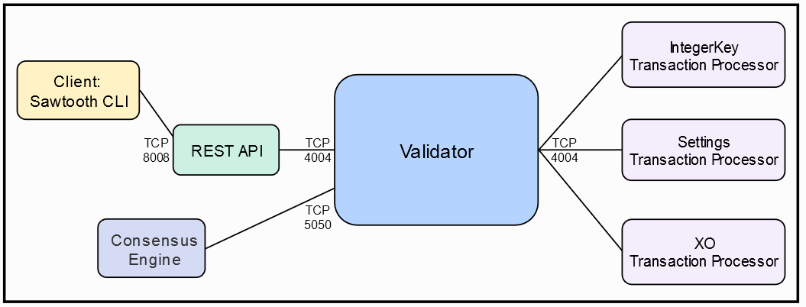

# Nodo simple de Sawtooth en Docker


En el docker-copose que vamos a usar tiene los siguientes componentes:

| Comonentes    	| Nombre del contenedor             	| Port 	| Nombre del host  	|   	|
|---------------	|-----------------------------------	|------	|------------------	|---	|
| Validator     	| sawtooth-validator-default        	| 4004 	| validator        	|   	|
| REST API      	| sawtooth-rest-api-default         	| 8008 	| rest-api         	|   	|
| Setting TP    	| sawtooth-settings-tp-default      	|      	| settings-tp      	|   	|
| IntegerKey TP 	| sawtooth-intkey-tp-python-default 	|      	| intkey-tp-python 	|   	|
| XO TP         	| sawtooth-xo-tp-python-default     	|      	| xo-tp-python     	|   	|
| Shell         	| sawtooth-shell-d



## Levantando el entorno.

Para levantar el entorno:

```bash
    vthot4@labcell:~/sawtooth$ docker-compose -f sawtooth-default.yaml up -d
    Creating network "docker_default" with the default driver
    Creating sawtooth-validator-default ... done
    Creating sawtooth-xo-tp-python-default        ... done
    Creating sawtooth-settings-tp-default         ... done
    Creating sawtooth-rest-api-default            ... done
    Creating sawtooth-devmode-engine-rust-default ... done
    Creating sawtooth-intkey-tp-python-default    ... done
    Creating sawtooth-shell-default               ... done

```
Podemos comprobar el estado de la sigueinte forma:

```bash
    ## Comprobar estado de los contedores
    vthot4@labcell:~/sawtooth-lab/one_node$ docker-compose -f sawtooth-default.yaml ps
                Name                              Command               State                Ports              
----------------------------------------------------------------------------------------------------------------
sawtooth-devmode-engine-rust-default   devmode-engine-rust -C tcp ...   Up                                      
sawtooth-intkey-tp-python-default      intkey-tp-python -vv -C tc ...   Up      4004/tcp                        
sawtooth-rest-api-default              sawtooth-rest-api -C tcp:/ ...   Up      4004/tcp, 0.0.0.0:8008->8008/tcp
sawtooth-settings-tp-default           settings-tp -vv -C tcp://v ...   Up      4004/tcp                        
sawtooth-shell-default                 bash -c sawtooth keygen && ...   Up      4004/tcp, 8008/tcp              
sawtooth-validator-default             bash -c sawadm keygen && s ...   Up      0.0.0.0:4004->4004/tcp          
sawtooth-xo-tp-python-default          xo-tp-python -vv -C tcp:// ...   Up      4004/tcp 
    
    ## Comprobar procesos
    vthot4@labcell:~/sawtooth-lab/one_node$ docker-compose -f sawtooth-default.yaml top

    ## Comprobar dockers levantados
    vthot4@labcell:~/sawtooth-lab/one_node$ docker ps -a
CONTAINER ID        IMAGE                                            COMMAND                  CREATED             STATUS              PORTS                              NAMES
5d63ef8c11c4        hyperledger/sawtooth-shell:chime                 "bash -c 'sawtooth k…"   9 minutes ago       Up 9 minutes        4004/tcp, 8008/tcp                 sawtooth-shell-default
1ea47e9ffa4b        hyperledger/sawtooth-intkey-tp-python:chime      "intkey-tp-python -v…"   9 minutes ago       Up 9 minutes        4004/tcp                           sawtooth-intkey-tp-python-default
1d18064887a0        hyperledger/sawtooth-devmode-engine-rust:chime   "devmode-engine-rust…"   9 minutes ago       Up 9 minutes                                           sawtooth-devmode-engine-rust-default
bf5541ebfb22        hyperledger/sawtooth-rest-api:chime              "sawtooth-rest-api -…"   9 minutes ago       Up 9 minutes        4004/tcp, 0.0.0.0:8008->8008/tcp   sawtooth-rest-api-default
133e232a7c5d        hyperledger/sawtooth-settings-tp:chime           "settings-tp -vv -C …"   9 minutes ago       Up 9 minutes        4004/tcp                           sawtooth-settings-tp-default
64192e6e38bb        hyperledger/sawtooth-xo-tp-python:chime          "xo-tp-python -vv -C…"   9 minutes ago       Up 9 minutes        4004/tcp                           sawtooth-xo-tp-python-default
7b36b823e8d0        hyperledger/sawtooth-validator:chime             "bash -c 'sawadm key…"   9 minutes ago       Up 9 minutes        0.0.0.0:4004->4004/tcp             sawtooth-validator-default
```
Tenemos varias opciones para ver los logs de salida del entorno:

```bash
    ## Ver la salida completa de los logs.
    vthot4@labcell:~/sawtooth-lab/one_node$ docker-compose -f sawtooth-default.yaml logs
    ...............
    sawtooth-settings-tp-default | INFO  | sawtooth_sdk::proces | TP_PROCESS_REQUEST sending TpProcessResponse: OK
    sawtooth-shell-default | creating key directory: /root/.sawtooth/keys
    sawtooth-shell-default | writing file: /root/.sawtooth/keys/root.priv
    sawtooth-shell-default | writing file: /root/.sawtooth/keys/root.pub
    sawtooth-validator-default | writing file: /etc/sawtooth/keys/validator.priv
    sawtooth-validator-default | writing file: /etc/sawtooth/keys/validator.pub
    sawtooth-validator-default | creating key directory: /root/.sawtooth/keys
    sawtooth-validator-default | writing file: /root/.sawtooth/keys/my_key.priv
    sawtooth-validator-default | writing file: /root/.sawtooth/keys/my_key.pub
    sawtooth-validator-default | Generated config-genesis.batch
    sawtooth-validator-default | Processing config-genesis.batch...
    sawtooth-validator-default | Processing config.batch...
    sawtooth-validator-default | Generating /var/lib/sawtooth/genesis.batch
    ...............

    ## Si queremos verlos en tiempo de ejecución
    vthot4@labcell:~/sawtooth-lab/one_node$ docker-compose -f sawtooth-default.yaml logs -f

    ## Si queremos ver los logs de un contenedor específico
    vthot4@labcell:~/sawtooth-lab/one_node$ docker log ${CONTAINER_ID}
    vthot4@labcell:~/sawtooth-lab/one_node$ log ${CONTAINER_ID} -f

```

## Primeras pruebas

Sawtooth incluye comandos que nos sirven para emular a un cliente. Este cliente interactuará con el validador a través del REST API. Para hacer alguna prueba vamos a entrar en la consola del cliente:

```bash
    vthot4@labcell:~/sawtooth-lab/one_node$ docker exec -it sawtooth-shell-default bash
    root@5d63ef8c11c4:/# intkey
    intkey            intkey-tp-python 

    ## Probamos que tenemos conectividad
        root@5d63ef8c11c4:/# curl http://rest-api:8008/blocks
    {
    "data": [
        {
        "batches": [
            {
            "header": {
                "signer_public_key": "0264932ee6abb807d6317876ccf867e91a3dc1d4f73a461346bd22d7a6573d14fd",
                "transaction_ids": [
    ..................
```
Esta información también la podemos obtener desde nuestro host ya que tenemos expuestos los puertos del REST-API:

```bash
    vthot4@labcell:~/sawtooth-lab/one_node$ curl http://localhost:8008/blocks
    {
    "data": [
        {
        "batches": [
            {
            "header": {
                "signer_public_key": "0264932ee6abb807d6317876ccf867e91a3dc1d4f73a461346bd22d7a6573d14fd",
                "transaction_ids": [
    ..................                
```

Podemos entrar a revisar el contenido de cualquier docker mediante:

```bash
    vthot4@labcell:~/sawtooth-lab/one_node$ docker exec -it {ContainerName} bash

    ## Ejemplo
    vthot4@labcell:~/sawtooth-lab/one_node$ docker exec -it sawtooth-validator-default bash

``` 


## LINKS

- https://sawtooth.hyperledger.org/docs/core/releases/1.2.3/app_developers_guide/docker.html


