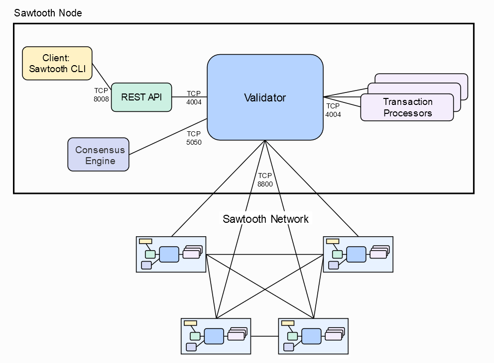

# Red Sawtooth con PBFT en Docker 

El entorno que vamos a levantar en nuestro equipo presenta la siguiente arquitectura:



En este ejemplo vamos a levantar una red Sawtooth con el consenso PBFT, un protocolo basado en votaciones.
En esta red, el primer nodo creará el bloque génesis, donde se especificará las caracterśiticas de la red.
Los otros nodos accederán a esas configuraciones cundo se unan a la red.

Podemos ver la configuración del primer validador, interesante ver que si el génesis ya esta creado lo recupera, por lo que 
mientras no borremos el volumen que se crea
```yaml
    validator-0:
        image: hyperledger/sawtooth-validator:chime
        container_name: sawtooth-validator-default-0
        expose:
        - 4004
        - 5050
        - 8800
        volumes:
        - pbft-shared:/pbft-shared
        command: |
        bash -c "
            if [ -e /pbft-shared/validators/validator-0.priv ]; then
            cp /pbft-shared/validators/validator-0.pub /etc/sawtooth/keys/validator.pub
            cp /pbft-shared/validators/validator-0.priv /etc/sawtooth/keys/validator.priv
            fi &&
            if [ ! -e /etc/sawtooth/keys/validator.priv ]; then
            sawadm keygen
            mkdir -p /pbft-shared/validators || true
            cp /etc/sawtooth/keys/validator.pub /pbft-shared/validators/validator-0.pub
            cp /etc/sawtooth/keys/validator.priv /pbft-shared/validators/validator-0.priv
            fi &&
            if [ ! -e config-genesis.batch ]; then
            sawset genesis -k /etc/sawtooth/keys/validator.priv -o config-genesis.batch
            fi &&
            while [[ ! -f /pbft-shared/validators/validator-1.pub || \
                    ! -f /pbft-shared/validators/validator-2.pub || \
                    ! -f /pbft-shared/validators/validator-3.pub || \
                    ! -f /pbft-shared/validators/validator-4.pub ]];
            do sleep 1; done
            echo sawtooth.consensus.pbft.members=\\['\"'$$(cat /pbft-shared/validators/validator-0.pub)'\"','\"'$$(cat /pbft-shared/validators/validator-1.pub)'\"','\"'$$(cat /pbft-shared/validators/validator-2.pub)'\"','\"'$$(cat /pbft-shared/validators/validator-3.pub)'\"','\"'$$(cat /pbft-shared/validators/validator-4.pub)'\"'\\] &&
            if [ ! -e config.batch ]; then
            sawset proposal create \
                -k /etc/sawtooth/keys/validator.priv \
                sawtooth.consensus.algorithm.name=pbft \
                sawtooth.consensus.algorithm.version=1.0 \
                sawtooth.consensus.pbft.members=\\['\"'$$(cat /pbft-shared/validators/validator-0.pub)'\"','\"'$$(cat /pbft-shared/validators/validator-1.pub)'\"','\"'$$(cat /pbft-shared/validators/validator-2.pub)'\"','\"'$$(cat /pbft-shared/validators/validator-3.pub)'\"','\"'$$(cat /pbft-shared/validators/validator-4.pub)'\"'\\] \
                sawtooth.publisher.max_batches_per_block=1200 \
                -o config.batch
            fi &&
            if [ ! -e /var/lib/sawtooth/genesis.batch ]; then
            sawadm genesis config-genesis.batch config.batch
            fi &&
            if [ ! -e /root/.sawtooth/keys/my_key.priv ]; then
            sawtooth keygen my_key
            fi &&
            sawtooth-validator -vv \
            --endpoint tcp://validator-0:8800 \
            --bind component:tcp://eth0:4004 \
            --bind consensus:tcp://eth0:5050 \
            --bind network:tcp://eth0:8800 \
            --scheduler parallel \
            --peering static \
            --maximum-peer-connectivity 10000
        "
```

## Probando el entorno

Para levantar el entorno usaremos el fichero de configuración: **sawtooth-default-pbft.yaml**

```bash
    vthot4@labcell:~/Trazabilidad/infrastructure/developer/Docker$ docker-compose -f sawtooth-default-pbft.yaml up -d 
        Creating network "docker_default" with the default driver
        Creating sawtooth-validator-default-0        ... done
        Creating sawtooth-intkey-tp-python-default-2 ... done
        Creating sawtooth-settings-tp-default-1      ... done
        Creating sawtooth-xo-tp-python-default-0     ... done
        Creating sawtooth-validator-default-4        ... done
        Creating sawtooth-validator-default-3        ... done
        Creating sawtooth-settings-tp-default-2      ... done
        Creating sawtooth-rest-api-default-4         ... done
        Creating sawtooth-pbft-engine-default-4      ... done
        Creating sawtooth-xo-tp-python-default-3     ... done
        Creating sawtooth-settings-tp-default-4      ... done
        Creating sawtooth-rest-api-default-2         ... done
        Creating sawtooth-xo-tp-python-default-2     ... done
        Creating sawtooth-pbft-engine-default-0      ... done
        Creating sawtooth-intkey-tp-python-default-4 ... done
        Creating sawtooth-xo-tp-python-default-1     ... done
        Creating sawtooth-rest-api-default-0         ... done
        Creating sawtooth-rest-api-default-3         ... done
        Creating sawtooth-settings-tp-default-3      ... done
        Creating sawtooth-pbft-engine-default-3      ... done
        Creating sawtooth-shell-default              ... done
        Creating sawtooth-pbft-engine-default-2      ... done
        Creating sawtooth-validator-default-2        ... done
        Creating sawtooth-pbft-engine-default-1      ... done
        Creating sawtooth-intkey-tp-python-default-0 ... done
        Creating sawtooth-intkey-tp-python-default-3 ... done
        Creating sawtooth-settings-tp-default-0      ... done
        Creating sawtooth-validator-default-1        ... done
        Creating sawtooth-xo-tp-python-default-4     ... done
        Creating sawtooth-intkey-tp-python-default-1 ... done
        Creating sawtooth-rest-api-default-1         ... done

```
Si todo ha ido bien nos habrá creado 31 dockers:

- 5 validator
- 5 Rest API
- 5 Settings
- 5 pbft-engine
- 5 Preprocessors intkey-tp.
- 5 Preprocessors xo-tp
- 1 Sawtooth-shell

```bash
        vthot4@labcell:~/Trazabilidad/infrastructure/developer/Docker$ docker-compose -f sawtooth-default-pbft.yaml ps
                    Name                              Command               State              Ports            
        -----------------------------------------------------------------------------------------------------------
        sawtooth-intkey-tp-python-default-0   intkey-tp-python -C tcp:// ...   Up      4004/tcp                    
        sawtooth-intkey-tp-python-default-1   intkey-tp-python -C tcp:// ...   Up      4004/tcp                    
        sawtooth-intkey-tp-python-default-2   intkey-tp-python -C tcp:// ...   Up      4004/tcp                    
        sawtooth-intkey-tp-python-default-3   intkey-tp-python -C tcp:// ...   Up      4004/tcp                    
        sawtooth-intkey-tp-python-default-4   intkey-tp-python -C tcp:// ...   Up      4004/tcp                    
        sawtooth-pbft-engine-default-0        pbft-engine -vv --connect  ...   Up                                  
        sawtooth-pbft-engine-default-1        pbft-engine -vv --connect  ...   Up                                  
        sawtooth-pbft-engine-default-2        pbft-engine -vv --connect  ...   Up                                  
        sawtooth-pbft-engine-default-3        pbft-engine -vv --connect  ...   Up                                  
        sawtooth-pbft-engine-default-4        pbft-engine -vv --connect  ...   Up                                  
        sawtooth-rest-api-default-0           bash -c                          Up      4004/tcp, 8008/tcp          
                                                sawtooth-rest-a ...                                                
        sawtooth-rest-api-default-1           bash -c                          Up      4004/tcp, 8008/tcp          
                                                sawtooth-rest-a ...                                                
        sawtooth-rest-api-default-2           bash -c                          Up      4004/tcp, 8008/tcp          
                                                sawtooth-rest-a ...                                                
        sawtooth-rest-api-default-3           bash -c                          Up      4004/tcp, 8008/tcp          
                                                sawtooth-rest-a ...                                                
        sawtooth-rest-api-default-4           bash -c                          Up      4004/tcp, 8008/tcp          
                                                sawtooth-rest-a ...                                                
        sawtooth-settings-tp-default-0        settings-tp -C tcp://valid ...   Up      4004/tcp                    
        sawtooth-settings-tp-default-1        settings-tp -C tcp://valid ...   Up      4004/tcp                    
        sawtooth-settings-tp-default-2        settings-tp -C tcp://valid ...   Up      4004/tcp                    
        sawtooth-settings-tp-default-3        settings-tp -C tcp://valid ...   Up      4004/tcp                    
        sawtooth-settings-tp-default-4        settings-tp -C tcp://valid ...   Up      4004/tcp                    
        sawtooth-shell-default                bash -c                          Up      4004/tcp, 8008/tcp          
                                                sawtooth keygen ...                                                
        sawtooth-validator-default-0          bash -c                          Up      4004/tcp, 5050/tcp, 8800/tcp
                                                if [ -e /pbft-s ...                                                
        sawtooth-validator-default-1          bash -c                          Up      4004/tcp, 5050/tcp, 8800/tcp
                                                if [ -e /pbft-s ...                                                
        sawtooth-validator-default-2          bash -c                          Up      4004/tcp, 5050/tcp, 8800/tcp
                                                if [ -e /pbft-s ...                                                
        sawtooth-validator-default-3          bash -c                          Up      4004/tcp, 5050/tcp, 8800/tcp
                                                if [ -e /pbft-s ...                                                
        sawtooth-validator-default-4          bash -c                          Up      4004/tcp, 5050/tcp, 8800/tcp
                                                if [ -e /pbft-s ...                                                
        sawtooth-xo-tp-python-default-0       xo-tp-python -vv -C tcp:// ...   Up      4004/tcp                    
        sawtooth-xo-tp-python-default-1       xo-tp-python -vv -C tcp:// ...   Up      4004/tcp                    
        sawtooth-xo-tp-python-default-2       xo-tp-python -vv -C tcp:// ...   Up      4004/tcp                    
        sawtooth-xo-tp-python-default-3       xo-tp-python -vv -C tcp:// ...   Up      4004/tcp                    
        sawtooth-xo-tp-python-default-4       xo-tp-python -vv -C tcp:// ...   Up      4004/tcp 
```

## Probando la funcionalidad.

Nos conectamos al shell container:

```bash
    vthot4@labcell:~/Docker$ docker exec -it sawtooth-shell-default bash
    root@7063cc7095ac:/# 
```
Para verificar si se ha producido el emparejamiento de los nodos:

```bash
    root@7063cc7095ac:/# curl http://sawtooth-rest-api-default-0:8008/peers
    {
    "data": [
        "tcp://validator-3:8800",
        "tcp://validator-1:8800",
        "tcp://validator-4:8800",
        "tcp://validator-2:8800"
    ],
    "link": "http://sawtooth-rest-api-default-0:8008/peers"
    }root@7063cc7095ac:/# 

    ## Podemos mostrar los pares de un nodo en particular
    root@7063cc7095ac:/# sawtooth peer list --url http://sawtooth-rest-api-default-0:8008
    tcp://validator-1:8800,tcp://validator-2:8800,tcp://validator-3:8800,tcp://validator-4:8800

    root@7063cc7095ac:/# sawtooth peer list --url http://sawtooth-rest-api-default-1:8008
    tcp://validator-0:8800,tcp://validator-2:8800,tcp://validator-3:8800,tcp://validator-4:8800

    ## Otra forma de sacar la relación de nodos es sawnet. Es interesante porque nos proporciona una forma fácil de pintarlos.
    root@7063cc7095ac:/# sawnet peers list http://sawtooth-rest-api-default-0:8008
    {
    "tcp://validator-0:8800": [
    "tcp://validator-1:8800",
    "tcp://validator-2:8800",
    "tcp://validator-3:8800",
    "tcp://validator-4:8800"
    ]
    }
```

Vamos a mandar una transacción simple para ver como se comporta:

```bash
    ## Mandamos la transacción:
    root@7063cc7095ac:/# intkey set --url http://sawtooth-rest-api-default-0:8008 MyKey 666 
    {
    "link": "http://sawtooth-rest-api-default-0:8008/batch_statuses?id=27c26f6c293f3cccc646c01accfad0e9fecabd065ec8b7a262eb0d30b881287951d5894039586b8b1a5e834cd392a8d4cbb98d1ecf1dbd09f5b4bd28a088b40b"
    }

    ##Comprobamos que la transacción se ha propagado al segundo nodo:
    root@7063cc7095ac:/# intkey show --url http://sawtooth-rest-api-default-1:8008 MyKey
    MyKey: 666
    root@7063cc7095ac:/# intkey show --url http://sawtooth-rest-api-default-2:8008 MyKey
    MyKey: 666

```
Si todo ha ido bien, podemos proceder a parar la red.

```
    vthot4@labcell:~/Trazabilidad/infrastructure/developer/Docker$ docker-compose -f sawtooth-default-pbft.yaml down
```


