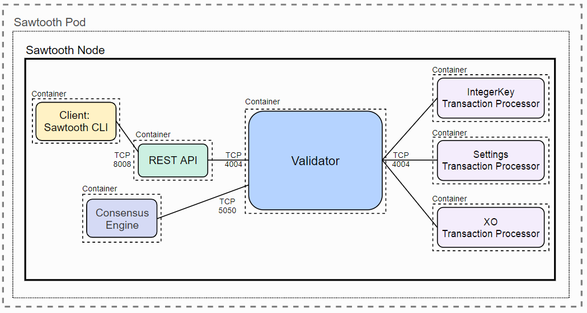

# Nodo simple de Sawtooth en kubernetes

El entorno que vamos a levantar en nuestro equipo presenta la siguiente arquitectura:



## Prerrequisitos
  ___________________________________
 
    kubectl + virtualbox + minikube  
  ___________________________________

*Instalación Kubectl*

Para instalar kubectl simplemente seguiremos esta guia: https://kubernetes.io/docs/tasks/tools/install-kubectl/

```bash

    ## Para la buena gente de Linux
    sudo apt-get update && sudo apt-get install -y apt-transport-https
    curl -s https://packages.cloud.google.com/apt/doc/apt-key.gpg | sudo apt-key add -
    echo "deb https://apt.kubernetes.io/ kubernetes-xenial main" | sudo tee -a /etc/apt/sources.list.d/kubernetes.list
    sudo apt-get update
    sudo apt-get install -y kubectl

    ## También podemos usar snap
    sudo snap install kubectl --classic
    kubectl version

    ## Los de Windows
    Install-Script -Name install-kubectl -Scope CurrentUser -Force
    install-kubectl.ps1 [-DownloadLocation <path>]

```

*Instalación hypervisor compatible*

Aunque podemos usar diferentes hypervisores, seleccionamos VirtualBox. https://www.virtualbox.org/wiki/Downloads

```bash
    ## Instalación simple para ubuntu
    sudo add-apt-repository multiverse && sudo apt-get update
    sudo apt install virtualbox
```

*Instalación minikube*

Como emulador de kubernetes usaremos minikube (https://kubernetes.io/docs/tasks/tools/install-minikube/).

```bash
    ## Instalación en Ubuntu
    curl -Lo minikube https://storage.googleapis.com/minikube/releases/latest/minikube-linux-amd64
    chmod +x minikube
    sudo mkdir -p /usr/local/bin/
    sudo install minikube /usr/local/bin/
```
Una vez instalado, levantamos minikube mediante:

```bash
  vthot4@labcell:~/sawtooth-lab/kubernetes/one_node$ minikube start
  ⚠️  minikube 1.6.1 is available! Download it: https://github.com/kubernetes/minikube/releases/tag/v/1.6.1
  💡  To disable this notice, run: 'minikube config set WantUpdateNotification false'
  😄  minikube v1.3.0 on Ubuntu 18.04
  💥  Kubernetes downgrade is not supported, will continue to use v1.17.0
  💡  Tip: Use 'minikube start -p <name>' to create a new cluster, or 'minikube delete' to delete this one.
  🔄  Starting existing virtualbox VM for "minikube" ...
  ⌛  Waiting for the host to be provisioned ...
  🐳  Preparing Kubernetes v1.17.0 on Docker 19.03.5 ...
  🔄  Relaunching Kubernetes using kubeadm ... 
  ⌛  Waiting for: apiserver proxy etcd scheduler controller dns
  🏄  Done! kubectl is now configured to use "minikube"
```
Por defecto,nos levantará con 2GB de RAM, si queremos, y nuestro equipo nos lo permite, podemos levantarlo con más memoria:

```bash
  vthot4@labcell:~/sawtooth-lab/kubernetes/one_node$ minikube delete
    🔥  Deleting "minikube" in virtualbox ...
    💔  The "minikube" cluster has been deleted.
  vthot4@labcell:~/adr/Trazabilidad$ minikube config set memory 4096
  vthot4@labcell:~/adr/Trazabilidad$ minikube start
    😄  minikube v1.3.0 on Ubuntu 18.04
    🔥  Creating virtualbox VM (CPUs=2, Memory=4096MB, Disk=20000MB) ...
    🐳  Preparing Kubernetes v1.15.2 on Docker 18.09.8 ...
    💾  Downloading kubeadm v1.15.2
    💾  Downloading kubelet v1.15.2

    🚜  Pulling images ...
    🚀  Launching Kubernetes ... 
    ⌛  Waiting for: apiserver proxy etcd scheduler controller dns
    🏄  Done! kubectl is now configured to use "minikube"

  ## Comprobamos que funciona correctamente.
  vthot4@labcell:~/sawtooth-lab/kubernetes/one_node$ kubectl get nodes
  NAME       STATUS   ROLES    AGE   VERSION
  minikube   Ready    master   41m   v1.15.2

  vthot4@labcell:~/sawtooth-lab/kubernetes/one_node$ kubectl run hello-minikube --image=k8s.gcr.io/echoserver:1.10 --port=8080
  kubectl run --generator=deployment/apps.v1 is DEPRECATED and will be removed in a future version. Use kubectl run --generator=run-pod/v1 or kubectl create instead.
  deployment.apps/hello-minikube created
  vthot4@labcell:~/sawtooth-lab/kubernetes/one_node$ kubectl expose deployment hello-minikube --type=NodePort
  service/hello-minikube exposed
  vthot4@labcell:~/sawtooth-lab/kubernetes/one_node$ kubectl get pods
  NAME                              READY   STATUS    RESTARTS   AGE
  hello-minikube-856979d68c-5mwqk   1/1     Running   0          53s

  vthot4@labcell:~/sawtooth-lab/kubernetes/one_node$ curl $(minikube service hello-minikube --url)

    Hostname: hello-minikube-856979d68c-5mwqk

    Pod Information:
            -no pod information available-

    Server values:
            server_version=nginx: 1.13.3 - lua: 10008

    Request Information:
            client_address=172.17.0.1
            method=GET
            real path=/
            query=
            request_version=1.1
            request_scheme=http
            request_uri=http://192.168.99.100:8080/

    Request Headers:
            accept=*/*
            host=192.168.99.100:30245
            user-agent=curl/7.58.0

    Request Body:
            -no body in request-

  ## Borramos los servicios de prueba
  vthot4@labcell:~/sawtooth-lab/kubernetes/one_node$ kubectl delete services hello-minikube
  service "hello-minikube" deleted
  vthot4@labcell:~/sawtooth-lab/kubernetes/one_node$ kubectl delete deployment hello-minikube
  deployment.extensions "hello-minikube" deleted

```
Si preferimos ver el estado desde un entorno gráfico:

```bash
    vthot4@labcell:~/sawtooth-lab/kubernetes/one_node$ minikube dashboard
  🤔  Verifying dashboard health ...
  🚀  Launching proxy ...
  🤔  Verifying proxy health ...
  🎉  Opening %s in your default browser...
```
Ya deberíamos tener todo lo necsario, así que vamos a levantar el entorno de sawtooth en minikube:

```bash
  ## Desplegamos el entorno
  vthot4@labcell:~/sawtooth-lab/kubernetes/one_node$ kubectl apply -f sawtooth-kubernetes-default.yaml 
  deployment.apps/sawtooth-0 created
  service/sawtooth-0 created

  ## Comprobamos que funciona correctamente
  vthot4@labcell:~/sawtooth-lab/kubernetes/one_node$ kubectl get pods
  NAME                          READY   STATUS    RESTARTS   AGE
  sawtooth-0-7b6df68b4f-dngjb   7/7     Running   0          4m9s
```

Con todo levantado podemos entrar en la consolla de sawtooth-shell para hacer algunas pruebas básicas.

```bash
  vthot4@labcell:~/sawtooth-lab/kubernetes/one_node$ kubectl exec -it $(kubectl get pods | awk '/sawtooth-0/{print $1}') --container sawtooth-shell -- bash
  root@sawtooth-0-7b6df68b4f-dngjb:/# curl http://localhost:8008/blocks
{
  "data": [
    {
      "batches": [
        {
          "header": {
            "signer_public_key": "031be31fe14c7dcd7bbb0e2f6f7df27c0f7aa321643f7753b3470c23268172a93e",
            "transaction_ids": [
              "4a0f6aa3a19cfe413c0de4c7e065cfc0b61035323ba47b940e4cbbfe5107198c2219c56edea0dd4b6853062a4c233e00dc90601120c184ac43a0660783c1a6bb"
.....................................

  root@sawtooth-0-7b6df68b4f-dngjb:/# sawtooth state list --format csv
  ADDRESS,SIZE,DATA
  000000a87cb5eafdcca6a8c983c585ac3c40d9b1eb2ec8ac9f31ff5ca4f3850ccc331a,45,b'\n+\n$sawtooth.consensus.algorithm.version\x12\x030.1'
  000000a87cb5eafdcca6a8c983c585ac3c40d9b1eb2ec8ac9f31ff82a3537ff0dbce7e,46,"b'\n,\n!sawtooth.consensus.algorithm.name\x12\x07Devmode'"
  000000a87cb5eafdcca6a8cde0fb0dec1400c5ab274474a6aa82c12840f169a04216b7,110,b'\nl\n&sawtooth.settings.vote.authorized_keys\x12B031be31fe14c7dcd7bbb0e2f6f7df27c0f7aa321643f7753b3470c23268172a93e'
  (data for head block: "7a789d64c3d9a7d660df467f9469246312cfb71f5fdf466e62098d537ed530634671b15632704f6eb9bcd39605a31711cbadfa361037abcebe65b1a487b01dc7")
```

Para parar el entornobastará con:

```bash
  vthot4@labcell:~/sawtooth-lab/kubernetes/one_node$ kubectl delete -f sawtooth-kubernetes-default.yaml 
  deployment.apps "sawtooth-0" deleted
  service "sawtooth-0" deleted
  vthot4@labcell:~/sawtooth-lab/kubernetes/one_node$ minikube stop
  ✋  Stopping "minikube" in virtualbox ...
  🛑  "minikube" stopped.
 vthot4@labcell:~/sawtooth-lab/kubernetes/one_node$ minikube delete
  🔥  Deleting "minikube" in virtualbox ...
  💔  The "minikube" cluster has been deleted.
```

