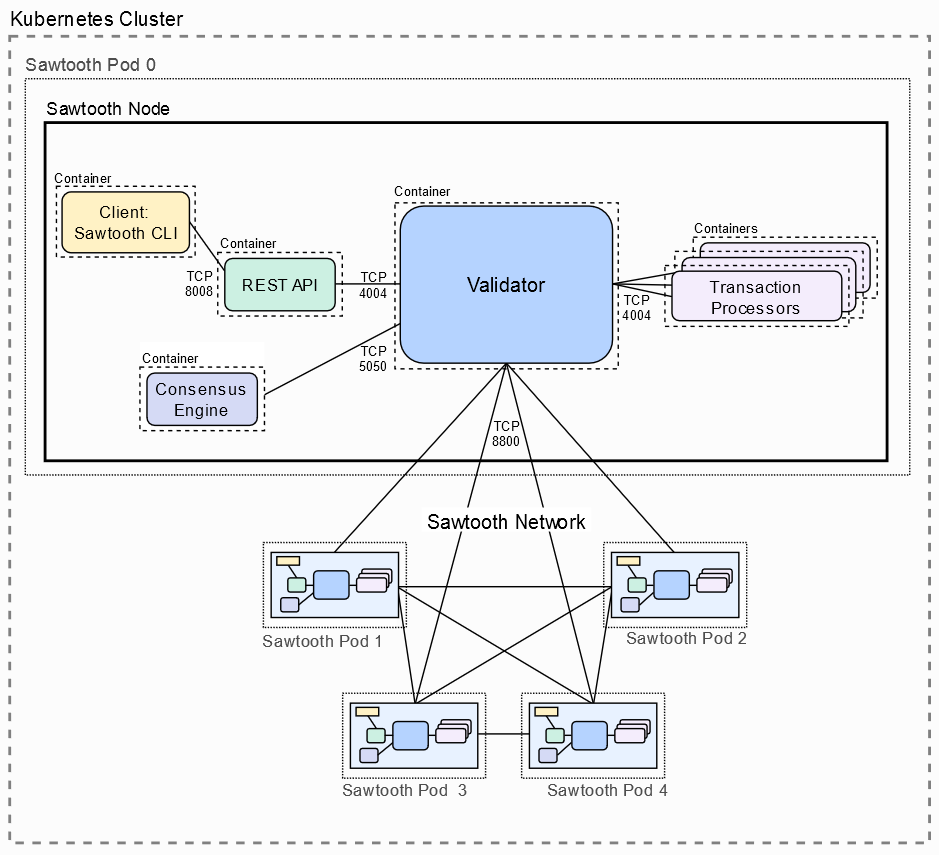

# Red de Sawtooth con PBFT en Kubernetes

Damos por supuesto que se ha probado la parte de crear un nodo en kubernetes por lo que omitiremos la parte de instalación de Minikube 
y los demás elementos necesarios. El esquema de la red que vamos a montar es el siguiente:



## Levantando el entorno.

Comenzamos levantando nuestro entorno de desarrollo con Minikube:

```bash
    vthot4@labcell:~/adr/Trazabilidad/Trazabilidad/infrastructure/developer/kubernetes/PBFT$ minikube start
    😄  minikube v1.3.0 on Ubuntu 18.04
    🔥  Creating virtualbox VM (CPUs=2, Memory=4096MB, Disk=20000MB) ...
    🐳  Preparing Kubernetes v1.15.2 on Docker 18.09.8 ...
    🚜  Pulling images ...
    🚀  Launching Kubernetes ... 
    ⌛  Waiting for: apiserver proxy etcd scheduler controller dns
    🏄  Done! kubectl is now configured to use "minikube" 
```
## Configurando las Keys.

Para crear una red que utiliza el consenso PBFT, la lista de miembros inicial debe especificarse en el bloque del génesis. Este paso genera claves de validador públicas y privadas para cada pod de la red y, a continuación, crea un ConfigMap de Kubernetes para que la red Sawtooth pueda usar estas claves cuando se inicie.

Para realizar esta operatoria vamos a crear dos ficheros:

**sawtooth-create-pbft-keys.yaml**

```yaml
    # Copyright 2019 Cargill Incorporated
    #
    # Licensed under the Apache License, Version 2.0 (the License);
    # you may not use this file except in compliance with the License.
    # You may obtain a copy of the License at
    #
    #     http://www.apache.org/licenses/LICENSE-2.0
    #
    # Unless required by applicable law or agreed to in writing, software
    # distributed under the License is distributed on an AS IS BASIS,
    # WITHOUT WARRANTIES OR CONDITIONS OF ANY KIND, either express or implied.
    # See the License for the specific language governing permissions and
    # limitations under the License.
    apiVersion: batch/v1
    kind: Job
    metadata:
    name: pbft-keys
    spec:
    template:
        spec:
        containers:
        - name: pbft-keys-generator
            image: hyperledger/sawtooth-shell
            command:
            - bash
            args:
            - -c
            - "for i in {0..4}; do sawadm keygen -q pbft${i}; done && cd /etc/sawtooth/keys/ && grep '' * | sed 's/\\.//' | sed 's/:/:\ /'"
        restartPolicy: Never
    backoffLimit: 4
```

**pbft-keys-configmap.yaml**
```yaml
    # Copyright 2019 Cargill Incorporated
    #
    # Licensed under the Apache License, Version 2.0 (the License);
    # you may not use this file except in compliance with the License.
    # You may obtain a copy of the License at
    #
    #     http://www.apache.org/licenses/LICENSE-2.0
    #
    # Unless required by applicable law or agreed to in writing, software
    # distributed under the License is distributed on an AS IS BASIS,
    # WITHOUT WARRANTIES OR CONDITIONS OF ANY KIND, either express or implied.
    # See the License for the specific language governing permissions and
    # limitations under the License.

    apiVersion: v1
    kind: ConfigMap
    metadata:
    name: keys-config
    data:
    pbft0priv: 
    pbft0pub: 
    pbft1priv: 
    pbft1pub: 
    pbft2priv: 
    pbft2pub: 
    pbft3priv: 
    pbft3pub: 
    pbft4priv: 
    pbft4pub: 
```

Comenzaremos creando las keys de nuestros futuros nodos:

```bash
    ## Creamos las claves. Si queremos crear más nodos batará con cambiar el "for i in {0..4};" 
    vthot4@labcell:~/developer/kubernetes/PBFT$ kubectl apply -f sawtooth-create-pbft-keys.yaml
    job.batch/pbft-keys created

    ## Obtenemos el nombre del pod que se ha ejecutado
    vthot4@labcell:~/developer/kubernetes/PBFT$ kubectl get pods |grep pbft-keys
    pbft-keys-hh8jw   0/1     ContainerCreating   0          19s

    ## Obtenemos las claves que necesitamos.
    vthot4@labcell:~/adr/Trazabilidad/Trazabilidad/infrastructure/developer/kubernetes/PBFT$ kubectl logs pbft-keys-hh8jw
    pbft0priv: bfb5afeef2c1137a729e908f49accf2e7355c37189c78f4b6fd6c370b4798b88
    pbft0pub: 022ffee8be0a5f19e10cc67abfa5198851290385d2193c467d4c764b56ed007c13
    pbft1priv: 7cb67b80aa6349208c97035574a30d224dd70f06f5acadee3591968775bb66f5
    pbft1pub: 0224f2dce00eff5605e8c7eb567e5abe92c6250d385dac7c0330d5c496295409d5
    pbft2priv: 8170e04f5df21a61939ff6069c6f1f2db8b88b28c2d9e05fdaf101d0ab647c94
    pbft2pub: 0279ed89f74601ce0f65cbe7eac54e4cbd88a6dad23a34593a2c76ded27d9634e1
    pbft3priv: 0bd444f2acaf065ba38ec16a66c17546169a1c04f1e280b3ec3f9be754453f42
    pbft3pub: 03dc6d17d31f09629c54758578a8a030a85e25b032dfaf895125d34c7a3467bdc8
    pbft4priv: f612d109164585c87de2aa2270d41f3e9665b4c5e6e714428c802ac97cc2aa65
    pbft4pub: 03d5b64cc70ca46f9293540dc7b95a54762ae5a63f309764955c6b49d74a33e835

```
Una vez obtenidas las claves, deberemos completar el fichero *pbft-keys-configmap.yaml* :

```
    # Copyright 2019 Cargill Incorporated
    #
    # Licensed under the Apache License, Version 2.0 (the License);
    # you may not use this file except in compliance with the License.
    # You may obtain a copy of the License at
    #
    #     http://www.apache.org/licenses/LICENSE-2.0
    #
    # Unless required by applicable law or agreed to in writing, software
    # distributed under the License is distributed on an AS IS BASIS,
    # WITHOUT WARRANTIES OR CONDITIONS OF ANY KIND, either express or implied.
    # See the License for the specific language governing permissions and
    # limitations under the License.

    apiVersion: v1
    kind: ConfigMap
    metadata:
    name: keys-config
    data:
    pbft0priv: bfb5afeef2c1137a729e908f49accf2e7355c37189c78f4b6fd6c370b4798b88
    pbft0pub: 022ffee8be0a5f19e10cc67abfa5198851290385d2193c467d4c764b56ed007c13
    pbft1priv: 7cb67b80aa6349208c97035574a30d224dd70f06f5acadee3591968775bb66f5
    pbft1pub: 0224f2dce00eff5605e8c7eb567e5abe92c6250d385dac7c0330d5c496295409d5
    pbft2priv: 8170e04f5df21a61939ff6069c6f1f2db8b88b28c2d9e05fdaf101d0ab647c94
    pbft2pub: 0279ed89f74601ce0f65cbe7eac54e4cbd88a6dad23a34593a2c76ded27d9634e1
    pbft3priv: 0bd444f2acaf065ba38ec16a66c17546169a1c04f1e280b3ec3f9be754453f42
    pbft3pub: 03dc6d17d31f09629c54758578a8a030a85e25b032dfaf895125d34c7a3467bdc8
    pbft4priv: f612d109164585c87de2aa2270d41f3e9665b4c5e6e714428c802ac97cc2aa65
    pbft4pub: 03d5b64cc70ca46f9293540dc7b95a54762ae5a63f309764955c6b49d74a33e835

```

Aplicamos el ConfigMap que la red de Sawtooth va a usar.

```bash
vthot4@labcell:~/developer/kubernetes/PBFT$ kubectl apply -f pbft-keys-configmap.yaml 
configmap/keys-config created
```

Comprobamos lo que hemos creado:

```bash
    vthot4@labcell:~/developer/kubernetes/PBFT$ kubectl get configmaps
    NAME          DATA   AGE
    keys-config   10     4m41s
```

```yaml
vthot4@labcell:~/adr/Trazabilidad/Trazabilidad/infrastructure/developer/kubernetes/PBFT$ kubectl get configmaps keys-config -o yaml
apiVersion: v1
data:
  pbft0priv: bfb5afeef2c1137a729e908f49accf2e7355c37189c78f4b6fd6c370b4798b88
  pbft0pub: 022ffee8be0a5f19e10cc67abfa5198851290385d2193c467d4c764b56ed007c13
  pbft1priv: 7cb67b80aa6349208c97035574a30d224dd70f06f5acadee3591968775bb66f5
  pbft1pub: 0224f2dce00eff5605e8c7eb567e5abe92c6250d385dac7c0330d5c496295409d5
  pbft2priv: 8170e04f5df21a61939ff6069c6f1f2db8b88b28c2d9e05fdaf101d0ab647c94
  pbft2pub: 0279ed89f74601ce0f65cbe7eac54e4cbd88a6dad23a34593a2c76ded27d9634e1
  pbft3priv: 0bd444f2acaf065ba38ec16a66c17546169a1c04f1e280b3ec3f9be754453f42
  pbft3pub: 03dc6d17d31f09629c54758578a8a030a85e25b032dfaf895125d34c7a3467bdc8
  pbft4priv: f612d109164585c87de2aa2270d41f3e9665b4c5e6e714428c802ac97cc2aa65
  pbft4pub: 03d5b64cc70ca46f9293540dc7b95a54762ae5a63f309764955c6b49d74a33e835
kind: ConfigMap
metadata:
  annotations:
    kubectl.kubernetes.io/last-applied-configuration: |
      {"apiVersion":"v1","data":{"pbft0priv":"bfb5afeef2c1137a729e908f49accf2e7355c37189c78f4b6fd6c370b4798b88","pbft0pub":"022ffee8be0a5f19e10cc67abfa5198851290385d2193c467d4c764b56ed007c13","pbft1priv":"7cb67b80aa6349208c97035574a30d224dd70f06f5acadee3591968775bb66f5","pbft1pub":"0224f2dce00eff5605e8c7eb567e5abe92c6250d385dac7c0330d5c496295409d5","pbft2priv":"8170e04f5df21a61939ff6069c6f1f2db8b88b28c2d9e05fdaf101d0ab647c94","pbft2pub":"0279ed89f74601ce0f65cbe7eac54e4cbd88a6dad23a34593a2c76ded27d9634e1","pbft3priv":"0bd444f2acaf065ba38ec16a66c17546169a1c04f1e280b3ec3f9be754453f42","pbft3pub":"03dc6d17d31f09629c54758578a8a030a85e25b032dfaf895125d34c7a3467bdc8","pbft4priv":"f612d109164585c87de2aa2270d41f3e9665b4c5e6e714428c802ac97cc2aa65","pbft4pub":"03d5b64cc70ca46f9293540dc7b95a54762ae5a63f309764955c6b49d74a33e835"},"kind":"ConfigMap","metadata":{"annotations":{},"name":"keys-config","namespace":"default"}}
  creationTimestamp: "2019-12-23T15:59:42Z"
  name: keys-config
  namespace: default
  resourceVersion: "2977"
  selfLink: /api/v1/namespaces/default/configmaps/keys-config
  uid: 2016a1d6-5ec3-4be9-8557-f4b33bad9f0b

```

## Levantamos la red Sawtooth

Para levantar la red desplegamos el siguiente .yaml

```bash
    vthot4@labcell:~/developer/kubernetes/PBFT$ kubectl apply -f sawtooth-kubernetes-default-pbft.yaml
    deployment.extensions/pbft-0 created
    service/sawtooth-0 created
    deployment.extensions/pbft-1 created
    service/sawtooth-1 created
    deployment.extensions/pbft-2 created
    service/sawtooth-2 created
    deployment.extensions/pbft-3 created
    service/sawtooth-3 created
    deployment.extensions/pbft-4 created
    service/sawtooth-4 created
```
Comprobamos que todo ha ido bien:

```bash
    vthot4@labcell:~/developer/kubernetes/PBFT$ kubectl get pods
    NAME                      READY   STATUS      RESTARTS   AGE
    pbft-0-79cc7b8d6f-nbql9   8/8     Running     0          2m44s
    pbft-1-74f4969c5-5vn9k    8/8     Running     0          2m44s
    pbft-2-6d67598b7f-tzn74   8/8     Running     0          2m44s
    pbft-3-74b4656576-hnrbf   8/8     Running     0          2m44s
    pbft-4-684b848846-9g5ll   8/8     Running     0          2m44s
    pbft-keys-hh8jw           0/1     Completed   0          34m

    ## Podemos ver los containers de un pod específico
        vthot4@labcell:~/developer/kubernetes/PBFT$ kubectl get pods pbft-0-79cc7b8d6f-nbql9 -o jsonpath={.spec.containers[*].name}
    sawtooth-intkey-tp-python sawtooth-pbft-engine sawtooth-rest-api sawtooth-settings-tp sawtooth-shell sawtooth-smallbank-tp-rust sawtooth-validator sawtooth-xo-tp-python
```
Vamos a probar si la red de Sawtooth funciona correctamente, para ello vamos a conectarnos al container shell del primer pod:
 
```bash
    vthot4@labcell:~/developer/kubernetes/PBFT$ kubectl exec -it pbft-0-79cc7b8d6f-nbql9 --container sawtooth-shell -- bash
    root@pbft-0-79cc7b8d6f-nbql9:/#

    ## Comprobamos los bloques de la cadena
    root@pbft-0-79cc7b8d6f-nbql9:/# sawtooth block list
    NUM  BLOCK_ID                                                                                                                          BATS  TXNS  SIGNER
    0    de9fd82df43fd2fa17aa8cdc4dc9edbc5ceec237095d6cd7e748bb6897ea21fa0e57688ec3a46c54b76f6ef9c22bf211692ab738a52142951bfadeddf3b05667  2     5     022ffe...

    ## Lista de nodos de la red
    root@pbft-0-79cc7b8d6f-nbql9:/# sawtooth peer list 
    tcp://10.106.49.57:8800,tcp://10.108.179.87:8800,tcp://10.109.124.192:8800,tcp://10.96.215.249:8800

    ## Lista de nodos de la red con formato
        root@pbft-0-79cc7b8d6f-nbql9:/# sawnet peers list http://localhost:8008
        {
        "tcp://10.107.77.150:8800": [
        "tcp://10.106.49.57:8800",
        "tcp://10.108.179.87:8800",
        "tcp://10.109.124.192:8800",
        "tcp://10.96.215.249:8800"
        ]
        }

```
En otro terminal vamos a conectarnos a otro de los nodos:

```bash
    vthot4@labcell:~/adr/Trazabilidad/Trazabilidad/infrastructure/developer/kubernetes/PBFT$ kubectl exec -it pbft-1-74f4969c5-5vn9k --container sawtooth-shell -- bash
    root@pbft-1-74f4969c5-5vn9k:/#
```

La prueba que vamos a hacer es ultramegasencilla, mandaremos una clave valor desde un nodo y comprobaremos que se ha replicado al otro.

```bash
    ## Escribimos la clave/valor con el procesor intkey.
    root@pbft-0-79cc7b8d6f-nbql9:/# intkey set MyKey 999
    {
    "link": "http://127.0.0.1:8008/batch_statuses?id=93488f03ccc7b1c27a739f87940cd04c4992ad53b346fa16689617800de5c6ea5cb47ebf48a5594b845fddc7cb959431ac51ff5ba0017ad216da5f94726ead99"
    }

    ## Comprobamos que se ha propagado a nuestro nodo.
    root@pbft-1-74f4969c5-5vn9k:/# intkey show MyKey
    MyKey: 999

    ## Podemos ver que se ha creado un nuevo bloque.
    root@pbft-0-79cc7b8d6f-nbql9:/# sawtooth block list
    NUM  BLOCK_ID                                                                                                                          BATS  TXNS  SIGNER
    1    fffce7e88f4ba6ee7fc6e315407a7db306637e7a30d6d2c48e5922c57ebb3a4d12e73bafb28545788aa069ffb68420a6037e26a3c9f9c652dcaf4a3df15d6bd6  1     1     022ffe...
    0    de9fd82df43fd2fa17aa8cdc4dc9edbc5ceec237095d6cd7e748bb6897ea21fa0e57688ec3a46c54b76f6ef9c22bf211692ab738a52142951bfadeddf3b05667  2     5     022ffe..

```

## Borrando el entorno
Si simplemente lo queremos parar para levantarlo con la misma configuración, bastará con ejecutar:

```bash
    vthot4@labcell:~/developer/kubernetes/PBFT$ minikube stop
```
Si preferimos borrarlo todo, bastara con seguir los sigueintes pasos:

```bash
    vthot4@labcell:~/developer/kubernetes/PBFT$ kubectl delete -f sawtooth-kubernetes-default-pbft.yaml
    deployment.extensions "pbft-0" deleted
    service "sawtooth-0" deleted
    deployment.extensions "pbft-1" deleted
    service "sawtooth-1" deleted
    deployment.extensions "pbft-2" deleted
    service "sawtooth-2" deleted
    deployment.extensions "pbft-3" deleted
    service "sawtooth-3" deleted
    deployment.extensions "pbft-4" deleted
    service "sawtooth-4" deleted

    vthot4@labcell:~/developer/kubernetes/PBFT$ minikube stop
✋  Stopping "minikube" in virtualbox ...
🛑  "minikube" stopped.

    vthot4@labcell:~/developer/kubernetes/PBFT$ minikube delete
    🔥  Deleting "minikube" in virtualbox ...
    💔  The "minikube" cluster has been deleted.
```